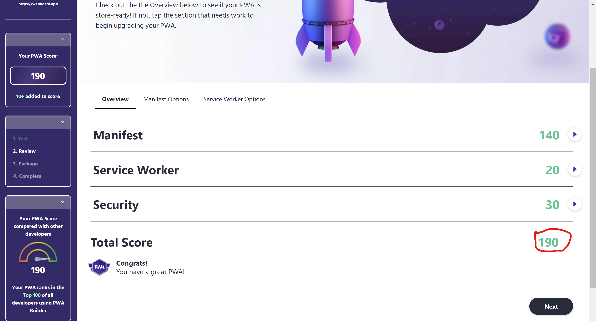
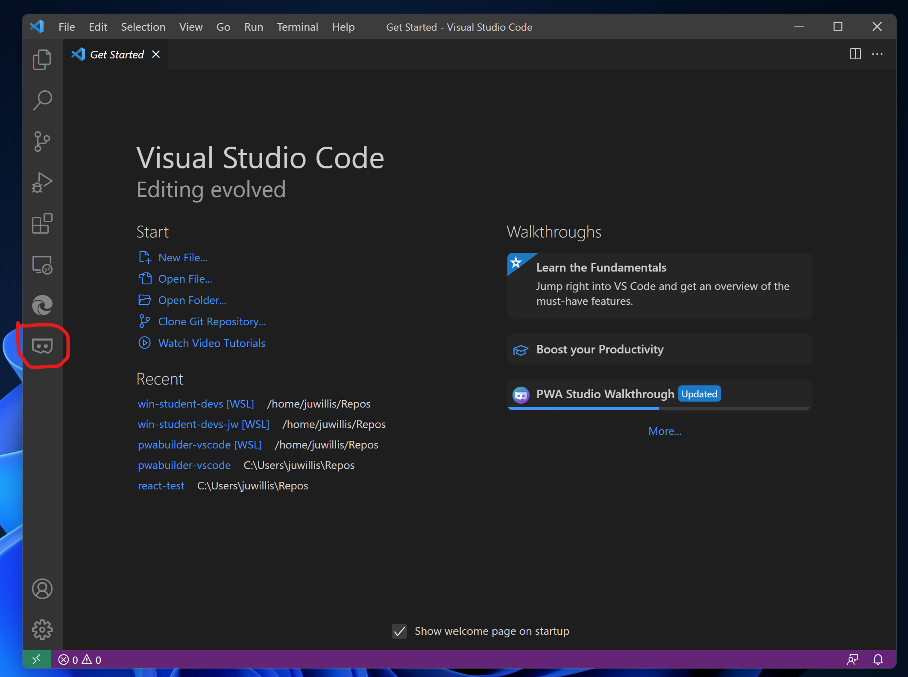
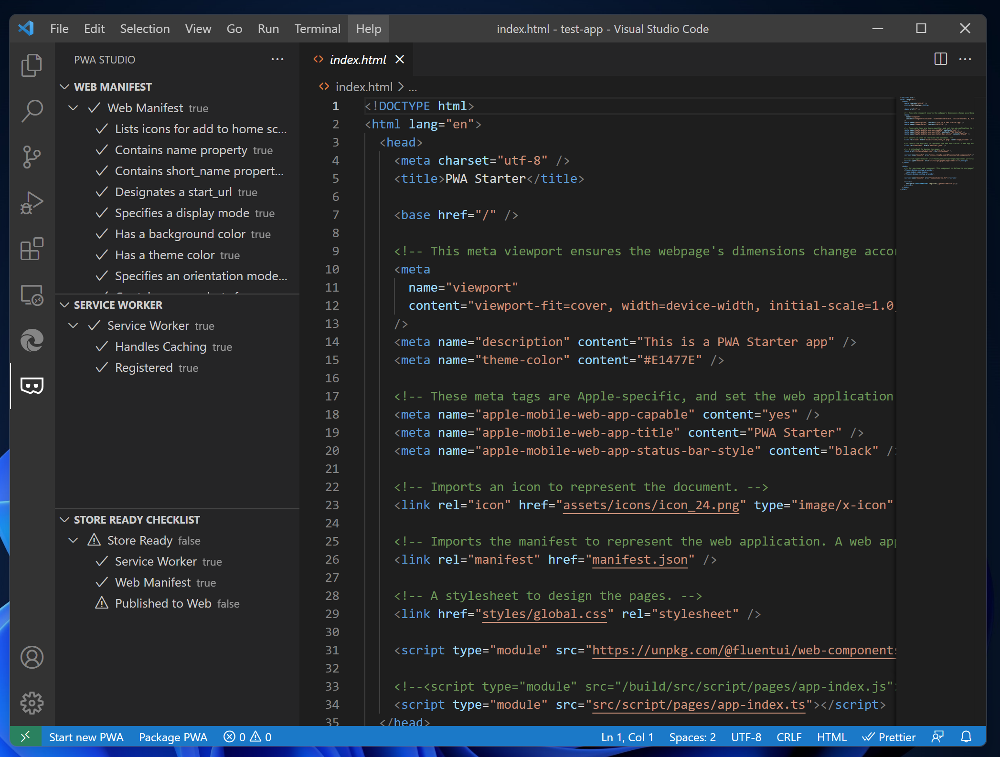
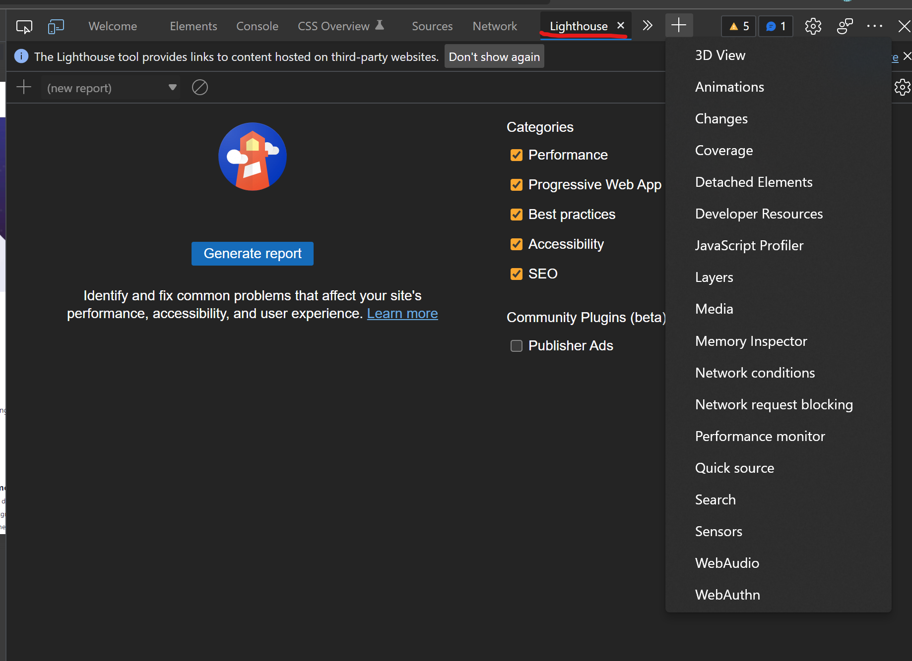

# 3.5: Auditing tools

**Author: Justin Willis (Software Engineer on the PWABuilder team) [@justinwillis96](https://twitter.com/Justinwillis96)**

Welcome to **Week 3 Day 5** of #30DaysOfPWA! Want to learn more about this project? Check out our [Kickoff](../kickoff.md) post to get more details on the content roadmap and contributors. Now, let's dive in!

### WHAT WE'LL COVER TODAY

| Section | Description |
| ------- | ----------- |
| **Why audit our PWA** | Why should you use these auditing tools? |
| **Audit with PWABuilder** | PWABuilder can tell you if our PWA is installable and store ready
| **Audit with Webhint** |Let's use these two new tools to create a new PWA with just a few button clicks.  |
| **Audit performance with Lighthouse and Edge Devtools** | Deep dive into some of the tools used in PWA Studio and Starter|

---

Hello! For today’s post on the 30 Days of PWA series, we will be learning how to audit a PWA and use those audits to help improve it's user experience.

## Why audit a PWA

So, why should we audit our PWA anyways? And what does this even mean?

When we are talking about auditing our PWA, we mean using tools to ensure that our PWA is: 

- Installable from the browser
- Ready to submit to app stores such as the Microsoft Store
- Accessible
- Fast

We do this to ensure our PWA is the best it can be for users. Users want high quality apps that are accessible, fast and discoverable, and auditing ensures we are meeting these requirements.

Today we are going to use PWABuider, Webhint and Edge Devtools to audit our PWA, let's dive in!

## Audit with PWABuilder

Let's start with PWABuilder. The focus of the audit PWABuilder does is to ensure our PWA is high-quality, installable, and ready to publish to app stores like the Microsoft Store. To do this, PWABuilder looks at the:

- Web Manifest
- Service Worker
- HTTPS Setup

and audits them based on a set of requirements. 
These also happen to be the technical essentials you need for an app to be considered a PWA. 

| Web Manifest | Service Worker | Security
| ------- | ----------- | ----------- |
| Properly linked + registered | Properly linked + registered | Uses HTTPS
| Contains required fields for installation | Works Offline | Valid HTTPS Setup
| Icons follow best practices | Suggested features to improve our offline experience | No HTTP content on page
| Suggested fields to improve our PWA or enable new features | | |

Each section above has a set of Required audits. These are audits that are required to be in the app stores and for installation from the browser. There are also Recommended and Optional audits for each section. These audit things such as, for example, manifest fields you can add to improve the installation experience of your PWA, but are not required.

To get started with PWABuilder's audits, you can use either [PWABuilder](https://aka.ms/learn-PWA/30Days-3.5/pwabuilder.com) or the [PWA Studio VSCode Extension](https://aka.ms/learn-PWA/30Days-3.5/pwa-studio).

### Getting audits from pwabuilder.com
Already have a published and live PWA that you want to audit? 

- Grab our URL and head over to https://aka.ms/learn-PWA/30Days-3.5/pwabuilder.com
- Enter the URL to our PWA on the homepage of pwabuilder.com and click Start

- pwabuilder.com will now analyze our PWA and return our audits

Each section is given an overall score. If we click on that section, it will give us more details on our score, including what you can add or change to get a better score. Towards the bottom of the page, we can see our total score.

If our total score is green, then our PWA is ready to publish and we are ready to click next to start packaging our PWA.

If our total score is yellow this means that our PWA is most likely ready to publish, but may be missing out on Recommended Features such as having a background_color in your Web Manifest. The section that is lowering our score will also have a yellow score. At that point, we should click on it to see what we need to add.

If our score is red, this means our PWA is not ready to publish to the web or app stores and needs additional work. The section with the problem will also have a red score. As above, you can click on that section to see what needs to be added next.

### Getting our audits with PWA Studio
PWA Studio enables you to audit with PWABuilder during development, not just after our PWA has gone live.

- Install PWA Studio from the [VSCode Marketplace](https://aka.ms/learn-PWA/30Days-3.5/pwa-studio)
- Open our codebase in VSCode
- Click the PWABuilder icon on the left side of VSCode

- You will now see your audits.

For PWA Studio, we are using a simpler way of showing our audits. As it shows in the above screenshot, there are three sections again, but slightly different this time: Web Manifest, Service Worker, Store Ready.

For each section, you will see a list of items. If that item is good to go, it will have a checkmark next to it, if not, it will have a caution symbol. For every item, you can click on the info icon in that item to learn more about it and how to fix the audit.

For the best PWA, we recommend checking off as many items as you can. If you are missing something that is required, PWA Studio will give you an alert when trying to publish to the web or package your PWA for the app stores.

## Audit a PWA with Webhint
You may have heard of [Webhint](https://aka.ms/learn-PWA/30Days-3.5/webhint.io) before, but did you know it's audits are built into the [Issues panel in Edge devtools?](https://aka.ms/learn-PWA/30Days-3.5/docs.microsoft.com/en-us/microsoft-edge/devtools-guide-chromium/issues)

The Issues panel allows you to quickly see any of the issues webhint detected in our app. On top of this, it also tells you which HTML element the problem affects and how to fix it.

.

To use it:
- Open our app in Edge
- Open [Edge devtools](https://aka.ms/learn-PWA/30Days-3.5/docs.microsoft.com/en-us/microsoft-edge/devtools-guide-chromium)
- Select the Issues tab. The Issues panel opens with issues grouped into different categories.
- Refresh our app, because some issues are reported based on network requests. Notice the updated count in the Issues counter.

## Audit performance with Lighthouse and Devtools

We are now ready to audit our app's loading performance, or how fast our PWA loads on different devices with varying network connections.

**Note** Edge devtools can also help you evaluate and improve our apps runtime performance. Check our [docs](https://aka.ms/learn-PWA/30Days-3.5/docs.microsoft.com/en-us/microsoft-edge/devtools-guide-chromium/evaluate-performance) to learn more.

Edge devtools has the [Lighhouse](https://aka.ms/learn-PWA/30Days-3.5/docs.microsoft.com/en-us/microsoft-edge/devtools-guide-chromium/speed/get-started) tool built in. Lighthouse can quickly evaluate our apps loading performance and give us suggestions on how to make it load faster. It will evaluate our app running on our device, but with CPU throttling and Network throttling to better match what you users experience. When talking about loading performance, it is important to remember that we need to ensure our apps load fast on our users devices, not just our development machines. Lighthouse enables us to do this directly from our development device.

To get started auditing our loading performance with Lighthouse:

- Open our app in Edge
- Open [Edge devtools](https://aka.ms/learn-PWA/30Days-3.5/docs.microsoft.com/en-us/microsoft-edge/devtools-guide-chromium)
- Open the Lighthouse tab in devtools 

- Click `Generate Report` to get a baseline report
- Analyze the report and make the suggested changes to our app.

For a full walkthrough on using Lighthouse to improve the loading performance of our application, check our [docs](https://aka.ms/learn-PWA/30Days-3.5/docs.microsoft.com/en-us/microsoft-edge/devtools-guide-chromium/speed/get-started). 

Using these tools, we can quickly make changes to our PWA to ensure it provides the best experience possible for our users. And, because PWAs are instantly updateable like normal websites, we can get these changes out to our users quickly!

In our next post, we’ll dive into converting our existing website to a PWA!

## Resources
- [pwabuilder.com](https://aka.ms/learn-PWA/30Days-3.5/pwabuilder.com)
- [PWA Studio VSCode Extension](https://aka.ms/learn-PWA/30Days-3.5/pwa-studio)
- [Edge devtools](https://aka.ms/learn-PWA/30Days-3.5/docs.microsoft.com/en-us/microsoft-edge/devtools-guide-chromium)
- [Evaluate Runtime Performance](https://aka.ms/learn-PWA/30Days-3.5/docs.microsoft.com/en-us/microsoft-edge/devtools-guide-chromium/evaluate-performance)
- [Evaluate Loading Performance](https://aka.ms/learn-PWA/30Days-3.5/docs.microsoft.com/en-us/microsoft-edge/devtools-guide-chromium/speed/get-started)